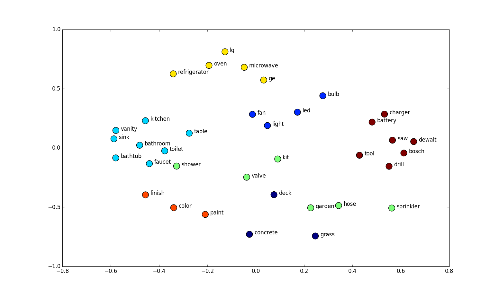

# AI.

What are the building blocks of an AI application?

---

## Vibe Check.

Do you interact with any AI-powered technologies in your daily life?? <!-- .element: class="fragment fade-in-then-out" -->
Overall, are your sentiments towards AI positive (yes) or negative (no)? <!-- .element: class="fragment fade-in-then-out" -->

---

## Models.

  

Recognize Patterns.

  

  

Make Predictions.

  

---

## What are embeddings?

A mathematical representation of data points in a way that captures the characteristics and properties relating to features of the originating model.

### Simplified

A list of fixed length numbers (length based on dimensionality) that indicates "relevance" of the data point.

---

## Embeddings Visualized.

<!-- .element: class="r-stretch" -->

<small>_Some example word vectors mapped to two dimensions.\
Source: http://suriyadeepan.github.io/img/seq2seq/we1.png_</small>

---

## Vector Databases.

  

 <!-- .element height="60%" width="60%" -->

<small>_The Office_</small>

  

  

Embedding storage engine optimized for retrieval and similarity search.

  

---

## The circle of l*AIIIIIIIIIIII*fe.

<!-- .element: class="r-stretch" -->

<small>_DALL·E 2 Prompt: "Lion King scene where Simba is presented to the pride but instead of a lion Simba is a computer"_</small>

---

## RAG: Retrieval Augmented Generation.

Sometimes the data used during training may not be enough.

RAG: a special class of AI that include:

- **information retrieval** _(sometimes called context)_
- **text generation**

---

## RAG: Retrieval Augmented Generation.

Often used for:

- **question answering** <!-- .element: class="fragment" -->
- **recommendation engines** <!-- .element: class="fragment" -->
- **document summarization** <!-- .element: class="fragment" -->
- **apps that need access to local information** <!-- .element: class="fragment" -->

---

## Adding RAG Context.

<!-- .element: class="r-stretch" -->

<small>_Example of adding a new piece of context data._</small>

---

## Querying through a RAG service.

<!-- .element: class="r-stretch" -->

<small>_Flow of information in a RAG query.\
Source: [Medium: Unlocking the Power of Retrieval Augmented Generation...](https://medium.com/@sharifghafforov00/unlocking-the-power-of-retrieval-augmented-generation-transforming-ai-with-contextual-a9201f74f2a3)_</small>

---

## Now to bring these ideas together.

- Move to: [AI ❤️ Serverless](?p=03-serverless-ai)
