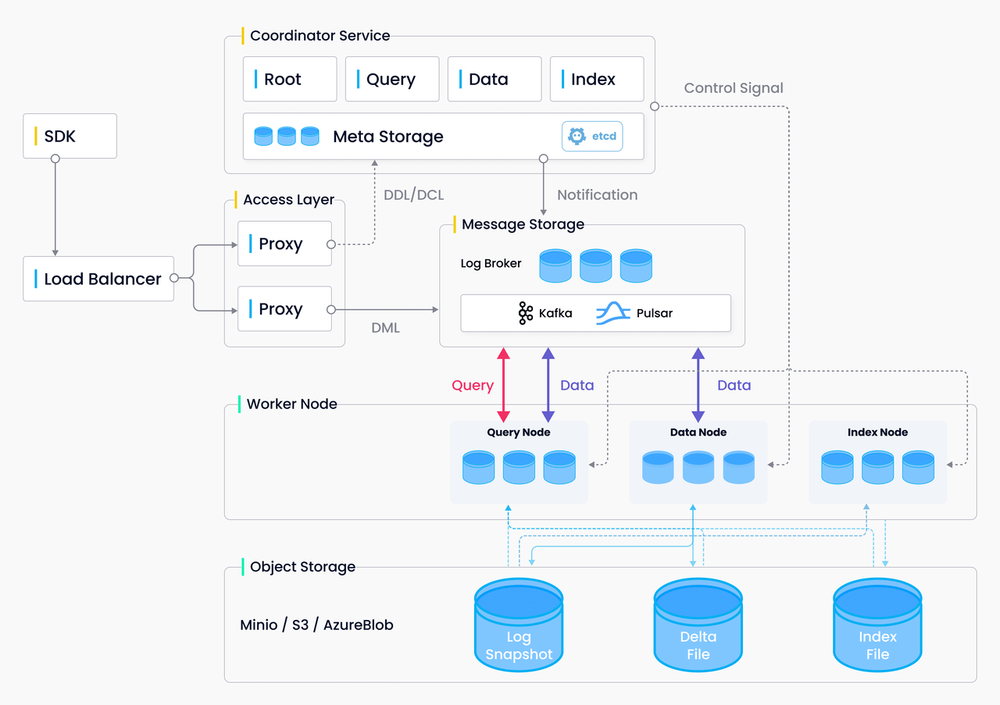
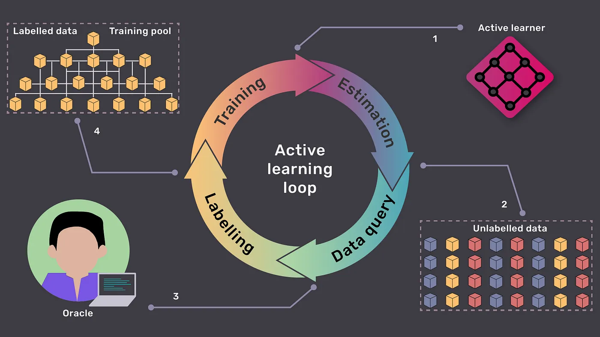
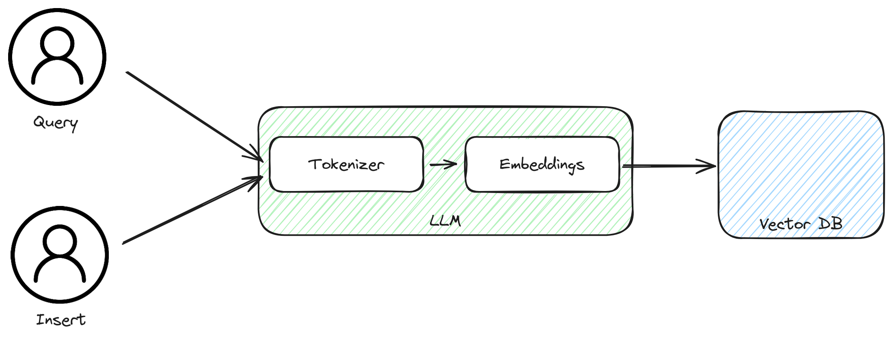
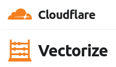

## Serverless AI.

**The new hotness. 🔥**

---

## Traditional: Real world example.

 <!-- .element height="50%" width="50%" -->

<small>_Architecture of the open source vector database Milvus.\
Source: https://milvus.io/docs/architecture_overview.md_</small>

---

## Traditional: Architecture.

- **Large number of components.**
- **Always running.**
- **Running distributedly still requires thought.**

Whether self hosted or using a provider, there's a(n) dedicated server(s) always running.

---

## Revisiting the learning loop.

 <!-- .element height="50%" width="50%" -->

<small>_The active learning loop. What is passive learning but slower active learning? 😄 \
Source: [Medium: Active Learning](https://medium.com/@farnazgh73/ultimate-guide-for-active-learning-main-approaches-3cf53ce207f0)_</small>

We spend a vast majority of time in the query portion! <!-- .element: class="fragment" -->

---

## Supporting serverless query & context augmentation.

 <!-- .element height="50%" width="50%" -->

<small>_Components necessary in both operations._</small>

We need both the model and the store available. <!-- .element: class="fragment" -->

---

## Serverless models.

⚡ Relatively static.\
💰 Can be heavy to load.\
🫤 Active learning probably out.\

If we can keep the model hot across the network, we make a good case here.

---

## Serverless Vector Databases.

💱 Changing on the fly.

  

  

  

 <!-- .element height="50%" width="50%" -->

  

  

 <!-- .element height="50%" width="50%" -->

  

---

## Break time.

<iframe width="560" height="315" src="https://www.youtube.com/embed/4ASKMcdCc3g?si=htNVR1zcL0ICy9nb" title="YouTube video player" frameborder="0" allow="accelerometer; autoplay; clipboard-write; encrypted-media; gyroscope; picture-in-picture; web-share" allowfullscreen></iframe>

---

## Lets make it happen. 👩‍🍳

- Move to: [Project](?p=04-project)
