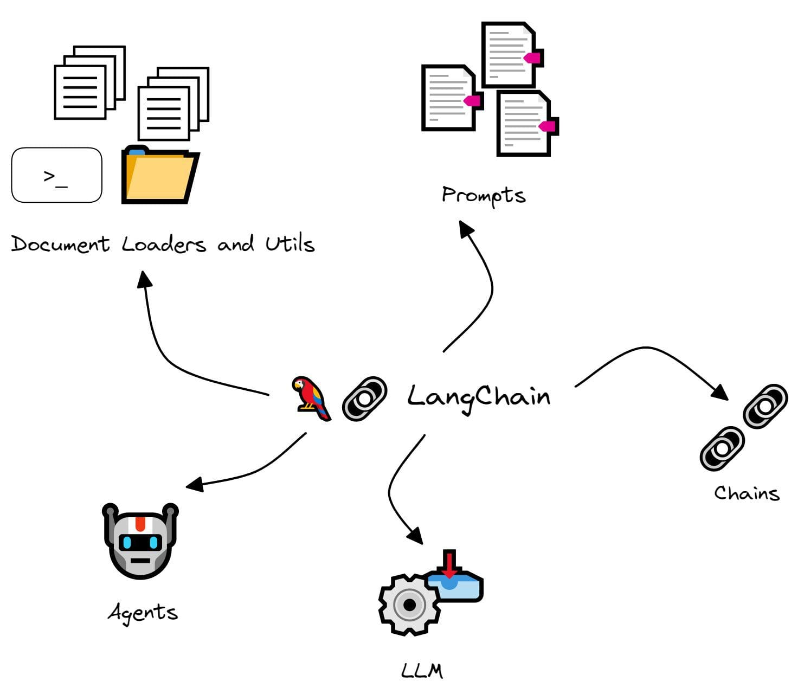

# Lets get physical!

 <!-- .element height="50%" width="50%" -->

---

## Time to put this into practice.

---

## Tools: Hono ୧⍤⃝💐.

Nice little microservice routing framework.

---

## Tools: Langchain 🔗.

 <!-- .element height="35%" width="35%" -->

<small>_Langchain components. \
Source: [LangChain 101: Build Your Own GPT-Powered Applications](https://www.kdnuggets.com/2023/04/langchain-101-build-gptpowered-applications.html)_</small>

**"The Legos of AI."**

---

## Bootstrap Repo.

 <!-- .element height="35%" width="35%" -->

https://github.com/ndisidore/bard-of-love

---

## Once finished.

[Its time for the outro](?p=outro)